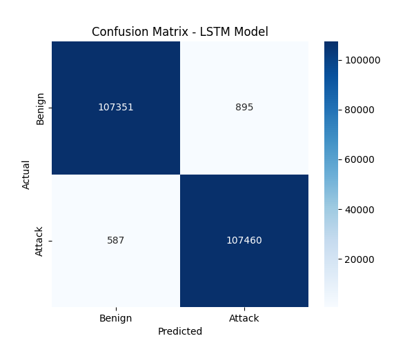
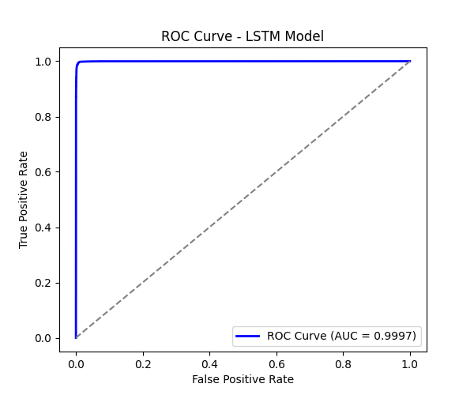
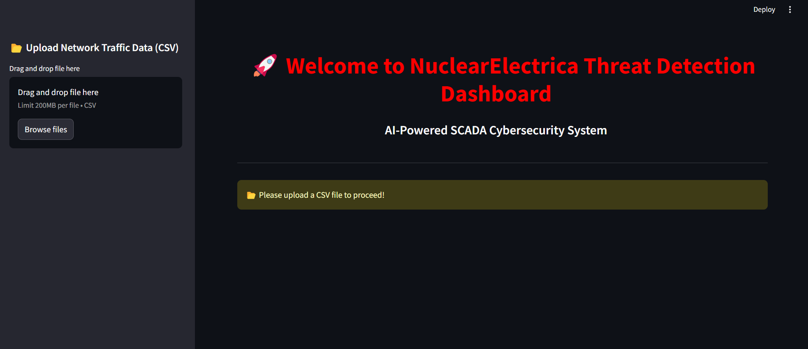
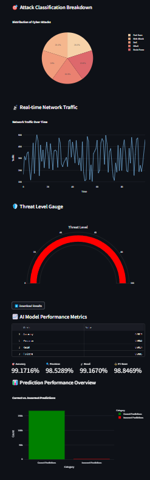

## **SCADA AI Detection**
An advanced AI-based anomaly detection system for SCADA (Supervisory Control and Data Acquisition) infrastructure using LSTM and explainable AI techniques. The dataset used is CICIDS 2017.

## 🔍 **Overview**
SCADA systems are critical for infrastructure. This project uses a deep learning-based approach (LSTM) to detect anomalies in SCADA time-series data, identifying potential cyber threats and operational failures. The training dataset used is CICIDS 2017, a publicly available dataset for cybersecurity anomaly detection.

## 🧠 **Data Preprocessing & Cleaning**
The CICIDS 2017 dataset contains network traffic data labeled with attack and normal behavior. Data preprocessing steps included:

Removing duplicate entries and irrelevant features.

Normalizing time-series data to prepare it for LSTM model training.

Feature selection to focus on relevant attributes for anomaly detection.

Handling missing values through imputation or removal.

Splitting the dataset into training and test sets, ensuring a balanced distribution of normal and attack data.

## 🧠 **Project Structure**
*A_preprocessing.py*: Preprocess SCADA data (CICIDS 2017 dataset).

*B_train_lstm.py*: Train the LSTM model.

*C_evaluate_lstm.py*: Evaluate the trained model.

*D_explain_lstm.py*: Use Explainable AI (e.g., SHAP) to explain predictions.

*E_animated_heatmap.py*: Generate animated heatmaps of anomalies.

## 📦 **Installation**
Clone the repository:
```
git clone https://github.com/raducu28/SCADA-AI-DETECTION.git
cd SCADA-AI-DETECTION
```

Create and activate a virtual environment:

**Linux/Mac:**
```
python -m venv venv
source venv/bin/activate
```
**Windows:**
```
python -m venv venv
venv\Scripts\activate
```

**Install dependencies:**
```
pip install -r requirements.txt
```

## 🚀 **How to Run**

Preprocess Data (CICIDS 2017 dataset):
```
python A_preprocessing.py
```

Train LSTM Model:
```
python B_train_lstm.py
```

Evaluate Model:
```
python C_evaluate_lstm.py
```

Explain Predictions:
```
python D_explain_lstm.py
```

Visualize Results with Heatmap:
```
python E_animated_heatmap.py
```

## 📋 **Additional Information**
Requirements:

Python 3.x

TensorFlow

SHAP

Other dependencies listed in requirements.txt

Usage Example: The A_preprocessing.py script loads and preprocesses data from the CICIDS 2017 dataset, which includes various types of cyber-attacks and normal traffic data. Afterward, B_train_lstm.py trains the LSTM model on the preprocessed data. The C_evaluate_lstm.py script evaluates the model's performance. Use D_explain_lstm.py for explainability via SHAP, and finally, visualize anomaly detection results with E_animated_heatmap.py.

### 📊 Evaluation Results

#### Confusion Matrix


#### ROC Curve


## 🤝 Contributing
We welcome contributions! If you'd like to improve this project, please fork the repository and create a pull request. Here are a few ways you can contribute:

Reporting bugs

Adding new features

Improving documentation

## 🎁 Bonus: Post-Factum GUI Interface
To showcase the full potential of the SCADA anomaly detection model, a Streamlit-based post-factum GUI is provided. This interactive interface allows users to explore the model's predictions, visualize results, and test the system with real data.

To get started:

Download the cleaned_file.csv from the cleaned_file.rar archive.

Run the GUI using the following command:
```
streamlit run NuclearElectrica.py
```
This provides a seamless way to interact with the trained model and see it in action!

### GUI Main Interface 


### POST FACTUM ANALYSIS


## 📝 License
This project is licensed under the MIT License – see the  file for details.
