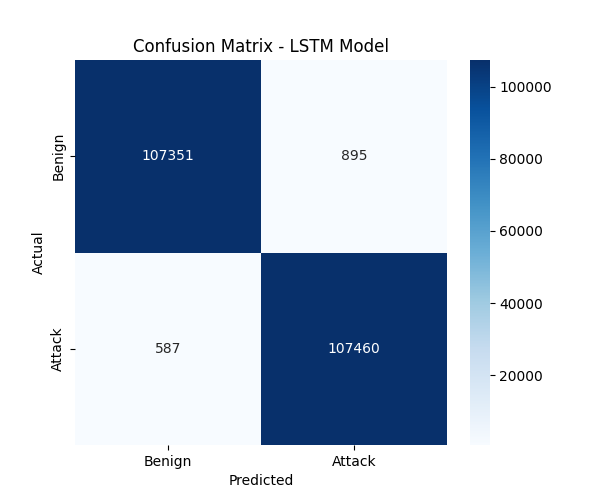
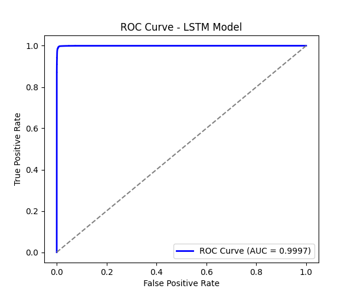
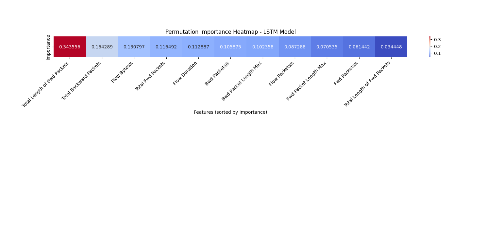

# SCADA AI Detection

An LSTM that reads network flows and flags the attacks among them, plus a measure of which
signals it relied on. Trained and tested on CIC-IDS 2017. M.Sc. project, 2025.

The full story, including what the score does and doesn't prove, is in the write-up:
**[radutodea.com/work/scada-ai](https://radutodea.com/work/scada-ai/)**

## Results

On a held-out 20% of the data (216,293 flows the model never saw):

| Accuracy | Precision | Recall | ROC AUC |
| --- | --- | --- | --- |
| 99.3% | 99.2% | 99.5% | 0.9997 |

| The flow was | Got it wrong | Got it right |
| --- | --- | --- |
| Benign (108,246) | 895 false alarms | 107,351 let through |
| An attack (108,047) | 587 missed | 107,460 caught |




## What the model relies on

Permutation importance: shuffle one feature at a time on the test set and measure how much
accuracy falls. The model leans hardest on what comes back: shuffling the total size of the
reply packets costs 34 points of accuracy, the number of reply packets 16, the byte rate 13.
The request side matters least: the total size of what was sent costs just 3. That reads
sensibly, since floods and scans get small replies, or none.



## How it works

| Script | What it does |
| --- | --- |
| `A_preprocessing.py` | Loads five CIC-IDS 2017 captures (a benign Monday; DoS; web attacks; DDoS; port scans), keeps 11 of the 79 flow features, drops broken values, clips outliers at the 99th percentile, standardises, and balances attack and benign 50/50. |
| `B_train_lstm.py` | Two stacked LSTM layers (64 and 32 units) with dropout and one sigmoid output: attack or benign. 80/20 split, 10 epochs. |
| `C_evaluate_lstm.py` | Confusion matrix, classification report and ROC curve on the held-out 20%. |
| `D_explain_lstm.py` | Permutation importance (scikit-learn) on the held-out 20%. |
| `E_animated_heatmap.py` | The same importance, computed over ten slices of the test set, as an animated heatmap. |
| `dashboard.py` | A Streamlit dashboard that replays a CSV through the trained model. |

A trained model is included: `models/lstm_scada_model.keras`.

## Run it

Python 3.10 (TensorFlow 2.11 needs 3.7–3.10).

```bash
git clone https://github.com/MechaCyberX/SCADA-AI-DETECTION.git
cd SCADA-AI-DETECTION
python -m venv venv && source venv/bin/activate   # Windows: venv\Scripts\activate
pip install -r requirements.txt
```

Download **MachineLearningCSV** from [CIC-IDS 2017](https://www.unb.ca/cic/datasets/ids-2017.html)
and put these five files in `data/`:

```
Monday-WorkingHours.pcap_ISCX.csv
Wednesday-workingHours.pcap_ISCX.csv
Thursday-WorkingHours-Morning-WebAttacks.pcap_ISCX.csv
Friday-WorkingHours-Afternoon-DDos.pcap_ISCX.csv
Friday-WorkingHours-Afternoon-PortScan.pcap_ISCX.csv
```

Then:

```bash
python A_preprocessing.py     # → data/processed_data.csv
python B_train_lstm.py        # → models/lstm_scada_model.keras
python C_evaluate_lstm.py
python D_explain_lstm.py
python E_animated_heatmap.py  # → animated_heatmap.gif
```

Dashboard: extract `cleaned_file.rar`, run `streamlit run dashboard.py`, and upload
`cleaned_file.csv`. The model is binary; the dashboard's attack-type breakdown and
live-traffic panels are illustrative, not model output.

## What the score doesn't say

- **Balanced data flatters.** The test set is half attacks; real networks are nearly all benign.
  At one attack in a thousand flows, the same 0.83% false-alarm rate means about eight false
  alarms for every real attack caught.
- **Random splits are generous.** Near-identical flows from the same attack sit on both sides
  of the split, and each attack type comes from its own capture day.
- **Scaling happens before the split,** so the test data shaped the preprocessing.
- **One flow at a time.** Each flow is a sequence of length one, so the LSTM works as a
  per-flow classifier. Windows of consecutive flows per host are where it would earn its place.
- **IT traffic isn't ICS traffic.** CIC-IDS 2017 is enterprise traffic: the attacks that hit
  the perimeter around a control system, not Modbus or DNP3 inside it.

The write-up covers each of these, and what the next version changes.

## Data

CIC-IDS 2017, Canadian Institute for Cybersecurity, University of New Brunswick.
Sharafaldin, Lashkari and Ghorbani, *Toward Generating a New Intrusion Detection Dataset and
Intrusion Traffic Characterization*, ICISSP 2018.

## License

MIT. See [LICENSE](LICENSE).
